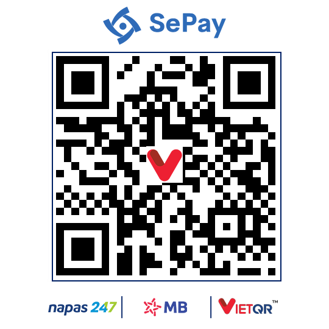

# Social Media Content Draftboard

Ứng dụng web đơn giản giúp quản lý nội dung mạng xã hội đa nền tảng. Công cụ này giúp bạn tổ chức, lên lịch và theo dõi bài đăng cho các nền tảng phổ biến như CoinMarketCap, BNB Square, X (Twitter), Telegram, Facebook và Threads.

**Ưu điểm chính:**
- Hoàn toàn miễn phí và mã nguồn mở
- Chạy offline trên trình duyệt, không cần cài đặt gì thêm
- Dữ liệu được lưu trữ cục bộ trên máy tính của bạn
- Giao diện trực quan, dễ sử dụng

## Tính năng

- **Giao diện lịch**: Tổ chức bài đăng theo thời gian và nền tảng trong dạng xem trực quan
- **Quản lý nội dung**: Tạo, chỉnh sửa và quản lý nội dung và hình ảnh bài đăng
- **Theo dõi trạng thái**: Đánh dấu bài đăng là "Đã đăng" hoặc "Chưa đăng"
- **Lọc**: Lọc bài đăng theo nền tảng, trạng thái và ngày
- **Xuất/Nhập**: Lưu và tải dữ liệu với chức năng xuất/nhập JSON
- **Hỗ trợ hình ảnh**: Tải lên hình ảnh, kéo và thả, hoặc dán từ clipboard
- **Chức năng sao chép**: Nhanh chóng sao chép nội dung và hình ảnh vào clipboard để đăng
- **Sao lưu tự động**: Tự động lưu dữ liệu để tránh mất dữ liệu khi trình duyệt đóng đột ngột
- **Hướng dẫn tích hợp**: Bao gồm hướng dẫn sử dụng chi tiết ngay trong ứng dụng
- **Hoạt động offline**: Hoạt động hoàn toàn trên trình duyệt, không cần kết nối internet

## Cách sử dụng

### Cài đặt

**Cách 1: Sử dụng phiên bản online**
- Không cần cài đặt gì, sử dụng ngay trên trình duyệt

**Cách 2: Sử dụng offline trên máy tính**
1. Tải file `index.html` về máy tính của bạn
2. Mở file bằng trình duyệt web (Chrome, Edge, Firefox, v.v.)
3. Ứng dụng sẽ hoạt động ngay lập tức

**Mẹo hữu ích:**
- Tạo shortcut đến file HTML trên màn hình chính để truy cập nhanh hơn
- Đặt bookmark trong trình duyệt để truy cập phiên bản online dễ dàng

### Lưu trữ dữ liệu

Dữ liệu được lưu trự tiếp trong trình duyệt của bạn (LocalStorage và IndexedDB). Để đảm bảo không mất dữ liệu:

- Sử dụng nút **Export** để xuất dữ liệu ra file JSON định kỳ
- Sử dụng nút **Import** để khôi phục dữ liệu từ file đã xuất trước đó
- Ứng dụng có tính năng tự động sao lưu để phòng trường hợp trình duyệt đóng đột ngột

## Cách sử dụng

### Thêm bài đăng

1. Nhấp vào nút "+" ở góc dưới bên phải hoặc nút "+" trong ô lịch
2. Chọn nền tảng, thời gian và nhập nội dung của bạn
3. Tùy chọn thêm hình ảnh bằng cách tải lên
4. Nhấp "Save" để thêm bài đăng vào lịch của bạn

### Chỉnh sửa bài đăng

1. Nhấp vào bất kỳ bài đăng nào trong chế độ xem lịch
2. Chỉnh sửa nội dung, nền tảng, thời gian hoặc hình ảnh
3. Nhấp "Save" để cập nhật bài đăng

### Đánh dấu bài đăng đã đăng

- Nhấp vào biểu tượng trạng thái trên bài đăng để chuyển đổi giữa trạng thái "Đã đăng" và "Chưa đăng"
- Hoặc chỉnh sửa bài đăng và sử dụng công tắc "Mark as Posted"

### Sao chép nội dung

- Khi chỉnh sửa bài đăng, nhấp vào nút "Copy" để sao chép văn bản
- Nhấp "Copy Image" để sao chép hình ảnh vào clipboard

### Lọc bài đăng

Sử dụng các điều khiển bộ lọc ở đầu trang để:
- Chọn một ngày cụ thể
- Lọc theo nền tảng
- Lọc theo trạng thái bài đăng

### Xuất/Nhập dữ liệu

- Nhấp vào nút "Export" để xuất tất cả dữ liệu của bạn dưới dạng file JSON
- Nhấp vào nút "Import" để nhập dữ liệu đã xuất trước đó

### Xóa tất cả dữ liệu

- Nhấp vào nút "Xóa tất cả" để xóa toàn bộ dữ liệu (sẽ có xác nhận trước khi xóa)
- Hữu ích khi bạn muốn dọn dẹp dữ liệu sau khi hoàn thành công việc trong ngày

## Ủng hộ dự án

Nếu bạn thấy công cụ này hữu ích và muốn ủng hộ việc phát triển, bạn có thể đóng góp qua các phương thức sau:

### Chuyển khoản ngân hàng

- Quét mã QR để chuyển khoản

### Ví tiền điện tử
- **BNB, ARB, OP, ETH:** 0xef349438ffa31b0c252c7fcb0ac8910537df6a75
- **SOL (USDT):** AErTASzb46sfe5eqbQ3dMuS3uiX4oFe1QTXxpAAbeYVh
- **TON:** UQATqTW71i59pkWFnTAv9x0LAZyeH-8M898UAfPUM-gIO7jO

### Các dự án khác
Xem thêm các công cụ hữu ích khác tại [johnnytrading.com](https://johnnytrading.com)

## Giấy phép

MIT
